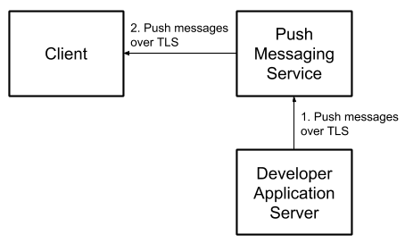
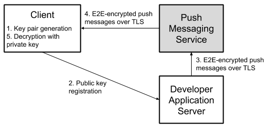

# Capillary

This is a library to simplify the sending of end-to-end (E2E) encrypted push messages from
Java-based application servers to Android clients. Please check the instructions below and the
[demo](demo) for more details.

## Installation

To add a dependency using Maven:

- For a Java-based server:
  ```xml
  <dependency>
    <groupId>com.google.capillary</groupId>
    <artifactId>lib</artifactId>
    <version>1.0.0</version>
  </dependency>
  ```

- For Android:
  ```xml
  <dependency>
    <groupId>com.google.capillary</groupId>
    <artifactId>lib-android</artifactId>
    <version>1.0.0</version>
  </dependency>
  ```

To add a dependency using Gradle:

- For a Java-based server:
  ```
  dependencies {
    compile 'com.google.capillary:lib:1.0.0'
  }
  ```
- For Android:
  ```
  dependencies {
    compile 'com.google.capillary:lib-android:1.0.0'
  }
  ```

## API docs

- Java:
  - [1.0.0](https://google.github.com/capillary/javadoc/lib/1.0.0)
- Android:
  - [1.0.0](https://google.github.com/capillary/javadoc/lib-android/1.0.0)

## Introduction

To use push messaging services to send messages to connected devices, developers must send them
through a third party messaging service, such as
[Firebase Cloud Messaging](https://firebase.google.com/docs/cloud-messaging/) (FCM).
It’s simple to encrypt message contents between the developer and the messaging service using https.
Major messaging services, including [FCM](https://firebase.google.com/docs/cloud-messaging/), also
encrypt messages between their servers and client devices.

However, messages between the developer server and the user devices are not encrypted
end-to-end (E2E):



E2E encryption can be achieved by generating an asymmetric encryption key pair on the client,
registering the public key with the developer messaging service, encrypting outgoing messages with
the public key, and decrypting messages on the client using the private key:



Capillary handles these operations for push messaging services used by Android apps. It includes:

- Crypto functionality and key management across all versions of Android back to
[KitKat](https://www.android.com/versions/kit-kat-4-4/) (API level 19).

- Key generation and registration workflows.

- Message encryption (on the server) and decryption (on the client).

- Integrity protection to prevent message modification.

- Edge-cases, such as users adding/resetting device lock after installing the app, users resetting
app storage, etc.

As a bonus, it also allows developers to require that devices are unlocked before selected messages
can be decrypted. This includes messages on devices using
[File-Based Encryption](https://source.android.com/security/encryption/file-based) (FBE):
encrypted messages are cached in Device Encrypted (DE) storage and message decryption keys are
stored in
[Android keystore](https://developer.android.com/training/articles/keystore.html) requiring
[user authentication](https://developer.android.com/training/articles/keystore#UserAuthentication).
This allows developers to specify messages with sensitive content to remain encrypted in cached form
until the user has unlocked and decrypted their device.

## API Options

### Web Push vs RSA-ECDSA

- Web Push
  
  **Pro:** Follows the [IETF RFC 8291](https://tools.ietf.org/html/rfc8291), therefore allows
  developers to share code and key storage infrastructure with existing Web Push implementations.
  Web Push protocol is based on the Elliptic-curve Diffie-Hellman (ECDH) key exchange algorithm,
  which is highly efficient for performance-constrained devices. Note that apps (as opposed to
  browsers) cannot receive raw Web Push messages through FCM, but Web Push messages can easily be
  wrapped in the appropriate FCM JSON by a proxy implementation, allowing you to use the same
  infrastructure with minor modifications.
  
  **Con:** Android Keystore does not support ECDH key operations. Keys are hybrid-encrypted with an
  RSA key stored in keystore meaning that EC private key plaintext is available in user memory
  during crypto operations.

- RSA-ECDSA
  
  **Pro:** Hybrid-encrypts a message with a client-generated RSA public key (for confidentiality)
  and signs the ciphertext with a developer-generated ECDSA public key (for integrity). RSA crypto
  operations (encrypt, decrypt) are supported by Android Keystore from SDK versions 18 (Jelly Bean)
  and above, meaning key material is not available outside of the trusted execution environment.
  This means even a sophisticated attacker with access to the device memory cannot access private
  key material (for example, to decrypt future messages arriving in Direct Boot mode).
  
  **Con:** Less efficient than ECDH and keys are not compatible with Web Push messaging standard.

### Auth vs NoAuth

Auth bound keys ensures that messages cannot be read by users when their device is locked, meaning
sensitive content will not be readable by shoulder-surfers or if the device is lost or stolen.

## API Overview

Capillary provides the core crypto functionality required to send (from an application server) and
receive encrypted push messages in Android apps. This covers:

- Generating and storing keys on the client.

- Encrypting and signing messages on the server.

- Decrypting and verifying encrypted messages on the client.

- Identifying encrypted messages that should be stored for later if received while the device is
  locked.

Because server-side architectures and push messaging use-cases are many and varied, it is not
practical to provide a server-side API to handle all possible push message implementations.
Therefore, we have decoupled the crypto functionality above from message transmission and
server-side key storage/retrieval functions. We have, however, provided a full-stack implementation
that uses Capillary to send E2E-encrypted push messages from a Java-based server to Android clients
in the [demo application](demo). In summary, you will need to implement the following aspects of the
solution yourself (using the [demo application](demo) and instructions below for guidance where
required):

- Registering public keys generated by Capillary with your application server.
- (on server) Indexing the public keys against your users/devices such that you can easily retrieve
  them them to encrypt message.
- Sending messages encrypted using Capillary to devices. Our [demo application](demo) uses FCM. But
  Capillary can be used with other push messaging services too.
- Passing encrypted push messages to Capillary for decryption.
- Requesting Capillary to decrypt any cached ciphertexts (i.e., those that were received while the
  device was locked) once the device is in an authenticated context (i.e., the users has unlocked
  the screen).
- Displaying or otherwise handling the messages decrypted by the Capillary library.

## API Integration

Please follow the following steps to integrate with the Capillary library.

### Prerequisites

Before the Capillary library can be used, it must be initialized at runtime as follows:
```java
import com.google.capillary.Config;

Config.initialize();
```

If you are using RSA-ECDSA algorithm, you need to generate an ECDSA public/private key pair and make
the public key available to your Android app (e.g., as a
[raw resource](https://developer.android.com/guide/topics/resources/providing-resources))
and private key available to your application server. Use the [utility program](tools) that we have
provided to generate such ECDSA key pairs:
```shell
$ ./gradlew tools:installDist
$ ./tools/build/install/tools/bin/ecdsa-key-pair-generator \
> --ecdsa_public_key_path=<path to new public key> \
> --ecdsa_private_key_path=<path to new private key>
```

### On Android Clients

#### Capillary Handler Implementation

The Capillary library uses methods of the 
[`CapillaryHandler`](lib-android/src/main/java/com/google/capillary/android/CapillaryHandler.java)
interface to provide responses, such as public keys, decrypted plaintexts, etc., back to the Android
app. Therefore, the first step in integrating an Android app with the Capillary library is to
implement the
[`CapillaryHandler`](lib-android/src/main/java/com/google/capillary/android/CapillaryHandler.java)
interface with your app-specific logic to handle the responses mentioned above. You can see how
the Capillary library's [demo Android app](demo/android) implements the
[`CapillaryHandler`](lib-android/src/main/java/com/google/capillary/android/CapillaryHandler.java) interface
in [`DemoCapillaryHandler`](demo/android/src/main/java/com/google/capillary/demo/android/DemoCapillaryHandler.java) class.

#### Key Generation

Each Capillary key pair is identified by a key pair ID (aka keychain ID), which is an arbitrary
string that is up to you to decide. To generate a key pair:
```java
import android.content.Context;
import com.google.capillary.android.RsaEcdsaKeyManager;
import com.google.capillary.android.WebPushKeyManager;
import java.io.InputStream;

Context context = ... // The current app context.
String keychainId = ... // Some identifier for the key pair.
boolean isAuth = ... // Whether the private key usage should be guarded by the device lock.

// To generate an RSA-ECDSA key pair.
InputStream senderVerificationKey = ... // The ECDSA public key of the server.
RsaEcdsaKeyManager.getInstance(context, keychainId, senderVerificationKey).generateKeyPair(isAuth);

// To generate a Web Push key pair.
WebPushKeyManager.getInstance(context, keychainId).generateKeyPair(isAuth);
```

There is also a [generateKeyPairs](lib-android/src/main/java/com/google/capillary/android/KeyManager.java)
method to generate both Auth and NoAuth keys in a single method call.

#### Public Key Retrieval
After generating a Capillary key pair, you can retrieve the generated public key in a byte array as
follows:
```java
import android.content.Context;
import com.google.capillary.android.CapillaryHandler;
import com.google.capillary.android.RsaEcdsaKeyManager;
import com.google.capillary.android.WebPushKeyManager;
import java.io.InputStream;

Context context = ... // The current app context.
String keychainId = ... // The identifier for the key pair.
boolean isAuth = ... // Whether the private key usage is guarded by the device lock.
CapillaryHandler handler = ... // An implementation of CapillaryHandler interface.
Object extra = ... // Any extra information to be passed back to the handler.

// To obtain an RSA-ECDSA public key.
InputStream senderVerificationKey = ... // The ECDSA public key of the server.
RsaEcdsaKeyManager.getInstance(context, keychainId, senderVerificationKey)
    .getPublicKey(isAuth, handler, extra);

// To obtain a Web Push public key.
WebPushKeyManager.getInstance(context, keychainId).getPublicKey(isAuth, handler, extra);

// The Capillary library returns a byte array representing the Capillary public key via the
// handlePublicKey method of the CapillaryHandler instance.
```

#### Decryption

After receiving a ciphertext generated using a Capillary public key, you can decrypt it as follows:
```java
import android.content.Context;
import com.google.capillary.android.CapillaryHandler;
import com.google.capillary.android.RsaEcdsaKeyManager;
import com.google.capillary.android.WebPushKeyManager;
import java.io.InputStream;

byte[] ciphertext = ... // The ciphertext received through FCM.
Context context = ... // The current app context.
String keychainId = ... // The identifier for the key pair.
CapillaryHandler handler = ... // An implementation of CapillaryHandler interface.
Object extra = ... // Any extra information to be passed back to the handler.

// To decrypt a ciphertext and pass the plaintext to the CapillaryHandler instance,
// (e.g. for display to the user):

// For RSA-ECDSA:
InputStream senderVerificationKey = ... // The ECDSA public key of the server.
RsaEcdsaKeyManager.getInstance(context, keychainId, senderVerificationKey)
    .getDecrypterManager().decrypt(ciphertext, handler, extra);

// For Web Push:
WebPushKeyManager.getInstance(context, keychainId)
    .getDecrypterManager().decrypt(ciphertext, handler, extra);

// The Capillary library returns a byte array representing the plaintext via the handleData
// method of the CapillaryHandler instance.
```

Keep in mind that during decryption, the Capillary library may automatically re-generate
the underlying Capillary key pairs if those key pairs are irrecoverably corrupted, which can happen,
for example, when the user adds/resets the device lock, resets app storage, etc. Such a newly
generated public key along with the Capillary ciphertext bytes that triggered key re-generation
will be passed to the Android app via the appropriate methods of the
[`CapillaryHandler`](lib-android/src/main/java/com/google/capillary/android/CapillaryHandler.java).

If the ciphertext has been generated using an Auth key but the Android device is in an
unauthenticated context, the Capillary library internally saves the ciphertext to be decrypted later
and informs the Android app via the
[authCiphertextSavedForLater](lib-android/src/main/java/com/google/capillary/android/CapillaryHandler.java)
method. This allows the Android app to handle cached ciphertexts, e.g. by telling the user messages
are available upon unlock. Upon the user unlocking the device, you can have the Capillary library
decrypt any saved ciphertexts as follows:
```java
import android.content.Context;
import com.google.capillary.android.CapillaryHandler;
import com.google.capillary.android.RsaEcdsaKeyManager;
import com.google.capillary.android.WebPushKeyManager;
import java.io.InputStream;

Context context = ... // The current app context.
String keychainId = ... // The identifier for the key pair.
CapillaryHandler handler = ... // An implementation of CapillaryHandler interface.
Object extra = ... // Any extra information to be passed back to the handler.

// To decrypt saved ciphertexts and pass the plaintexts to the CapillaryHandler instance,
// (e.g. for display to the user):

// For RSA-ECDSA:
InputStream senderVerificationKey = ... // The ECDSA public key of the server.
RsaEcdsaKeyManager.getInstance(context, keychainId, senderVerificationKey)
    .getDecrypterManager().decryptSaved(handler, extra);

// For Web Push:
WebPushKeyManager.getInstance(context, keychainId)
    .getDecrypterManager().decryptSaved(handler, extra);

// For each decrypted ciphertext, the Capillary library returns a byte array representing the
// plaintext via the handleData method of the CapillaryHandler instance.
```

There are several ways to trigger the handler for cached ciphertext upon device unlock. The approach
used by the Capillary library's [demo Android app](demo/android) is to listen for the
[ACTION_USER_PRESENT](https://developer.android.com/reference/android/content/Intent.html#ACTION_USER_PRESENT)
broadcast intent. See
[`DeviceUnlockedBroadcastReceiver`](android/src/main/java/com/google/capillary/demo/android/DeviceUnlockedBroadcastReceiver.java)
for more details.

#### Key Deletion

To delete a Capillary key pair:
```java
import android.content.Context;
import com.google.capillary.android.RsaEcdsaKeyManager;
import com.google.capillary.android.WebPushKeyManager;
import java.io.InputStream;

Context context = ... // The current app context.
String keychainId = ... // The identifier for the key pair.
boolean isAuth = ... // Whether the private key usage is guarded by the device lock.

// To delete an RSA-ECDSA key pair.
InputStream senderVerificationKey = ... // The ECDSA public key of the server.
RsaEcdsaKeyManager.getInstance(context, keychainId, senderVerificationKey).deleteKeyPair(isAuth);

// To delete a Web Push key pair.
WebPushKeyManager.getInstance(context, keychainId).deleteKeyPair(isAuth);
```

### On Java Application Servers

The Capillary library provides the functionality to encrypt messages on Java-based application
servers. 

#### Encryption

To encrypt a message using a Capillary public key:

```java
import com.google.capillary.EncrypterManager;
import com.google.capillary.RsaEcdsaEncrypterManager;
import com.google.capillary.WebPushEncrypterManager;
import java.io.InputStream;

byte[] recipientPublicKey = ... // The Capillary public key of the client.
byte[] message = ... // The message to be sent to the client.

// To create an RSA-ECDSA ciphertext.
InputStream senderSigningKey = ... // The ECDSA private key of the server.
EncrypterManager rsaEcdsaEncrypterManager = new RsaEcdsaEncrypterManager(senderSigningKey);
rsaEcdsaEncrypterManager.loadPublicKey(recipientPublicKey);
byte[] ciphertext = rsaEcdsaEncrypterManager.encrypt(message);
// This step is not strictly necessary, but it ensures that the EncrypterManager releases the
// stored public key for garbage collection.
rsaEcdsaEncrypterManager.clearPublicKey();

// To create a Web Push ciphertext.
EncrypterManager webPushEncrypterManager = new WebPushEncrypterManager();
webPushEncrypterManager.loadPublicKey(recipientPublicKey);
byte[] ciphertext = webPushEncrypterManager.encrypt(message);
webPushEncrypterManager.clearPublicKey();
```

## Maintainers

The Capillary library is maintained by the following Googlers:

- [Milinda Perera](https://milinda-perera.com), Software Engineer
- [Giles Hogben](http://www.gilestv.com/frallet/), Privacy Engineer
